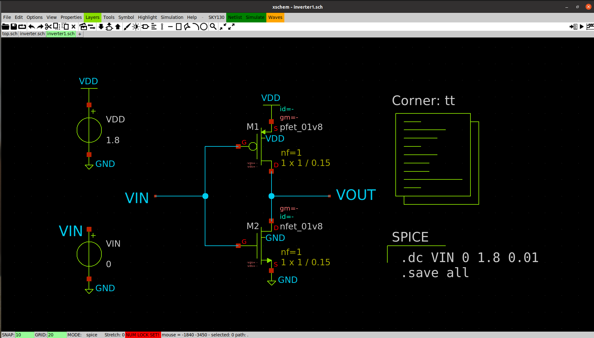
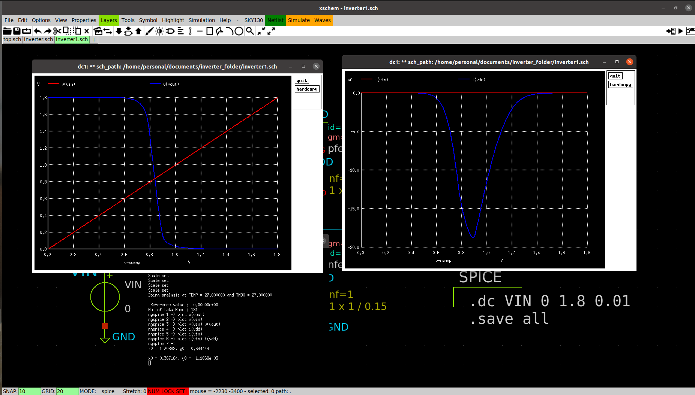
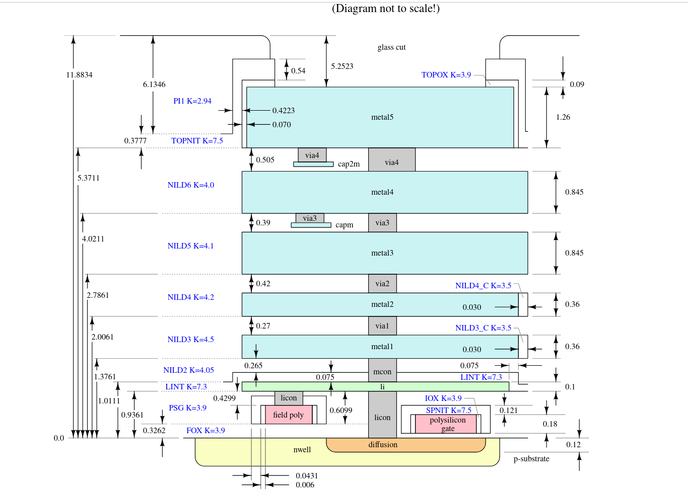
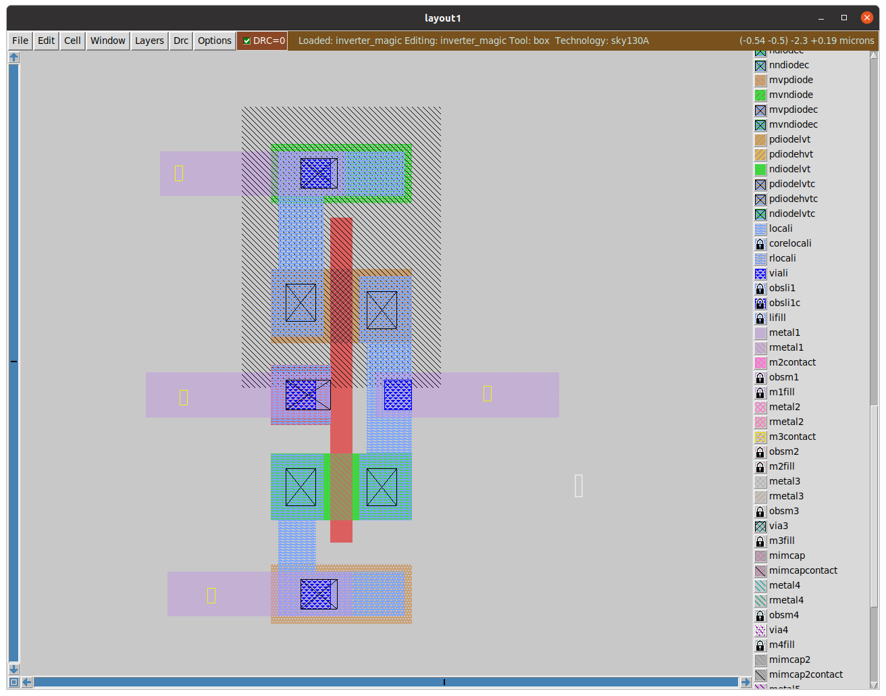
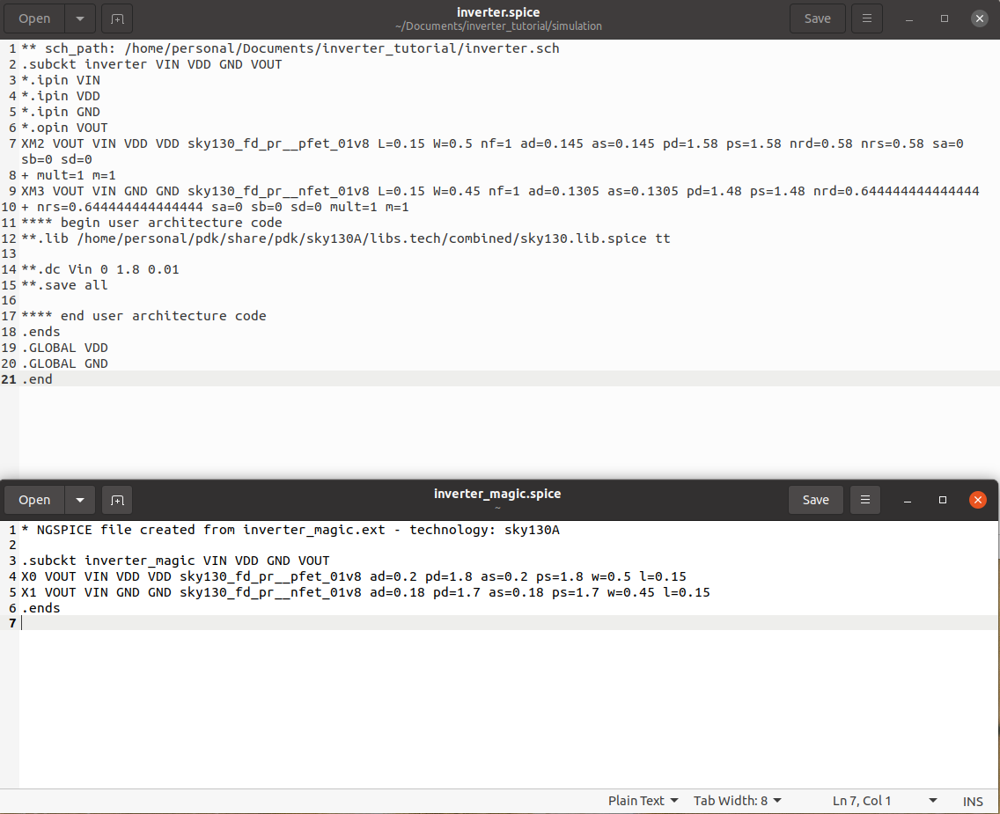
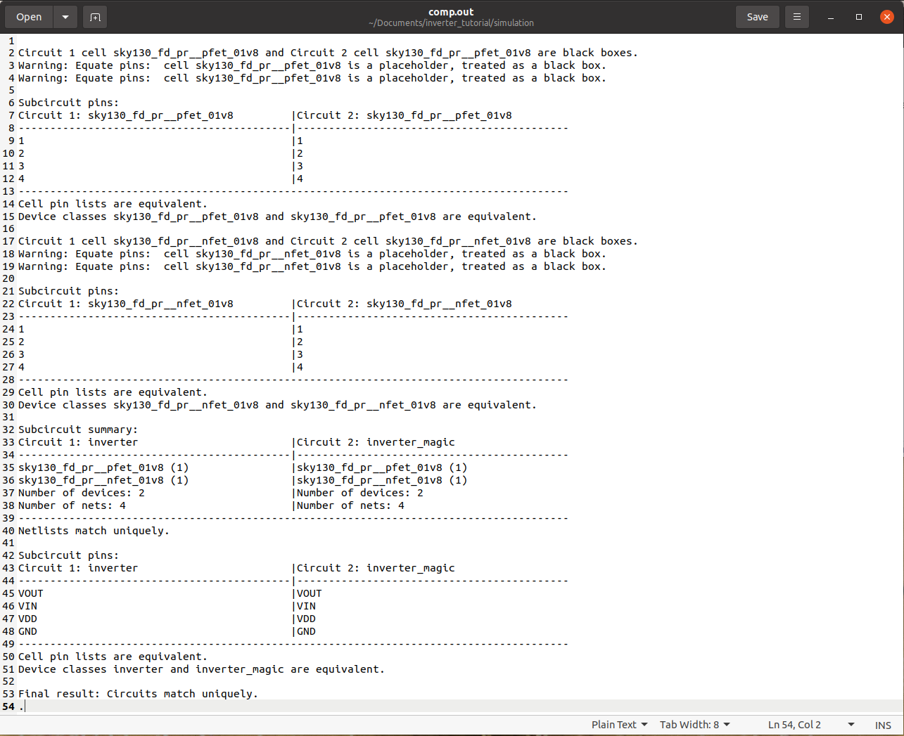

# CMOS Inverter using SKY130 PDK
This project demonstrates the design of a CMOS inverter using the open-source SkyWater SKY130 process node. The schematic was created in Xschem, simulated using Ngspice, the layout was drawn in Magic VLSI, and LVS was done using Netgen.
## Schematic
- The inverter was built using sky130_fd_pr__nfet_01v8 and sky130_fd_pr__pfet_01v8 transistors from the SKY130 standard cell library.
- Both transistors were sized with a width of 1 µm and length of 0.15 µm (W/L = 1/0.15), optimized for a 1.8 V power supply.
- The simulation used the tt corner model (Typical NMOS and PMOS).

## Simulation
- The input voltage (VIN) was swept from 0 V to 1.8 V in steps of 10 mV.
- The output waveform shows correct inverter behavior, demonstrating a sharp transition between logic levels.
- Current consumption during switching was also observed, confirming dynamic behavior.

## Layout Design 
- The layout was created in Magic VLSI, using the SKY130 process stack as a reference.

- The following layers were used: nwell, ndiffusion, pdiffusion, polysilicon, locali, ndiffusion contact, pdiffusion contact, viali, and metal1.
- The layout passed DRC (Design Rule Check) successfully.

## LVS (Layout vs Simulation)
- SPICE netlists were generated from both the schematic (inverter.spice) and the layout (inverter_magic.spice).

- Netgen was used to perform LVS (Layout vs. Schematic) comparison.
- The comparison was successful, and the output was saved in (comp.out)

